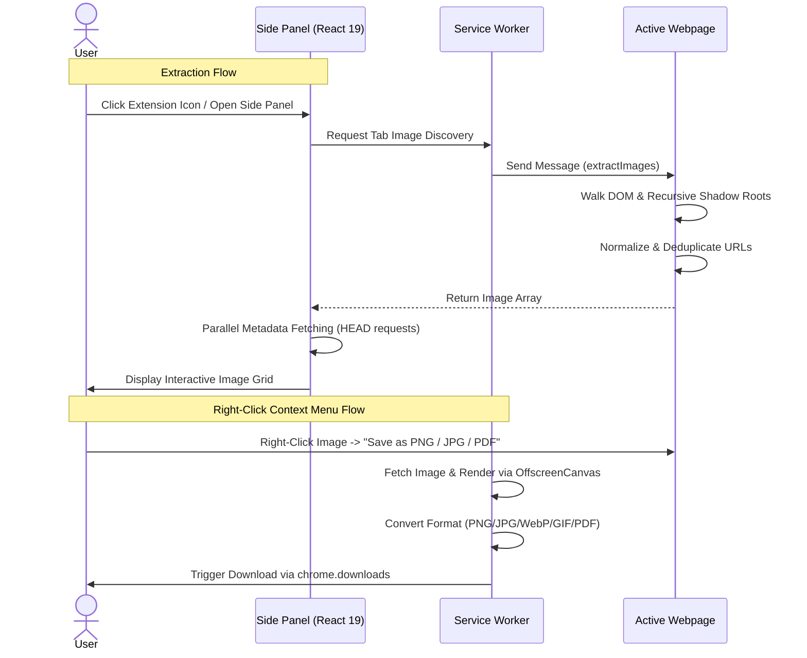

#  Pixel — Image Extractor

<p align="center">
  <em>A high-performance Chrome side panel extension and standalone web application for discovering, analyzing, converting, and exporting images from any webpage.</em>
</p>

<p align="center">
  <a href="#key-features"></a>
  <a href="#tech-stack"></a>
  <a href="#tech-stack"></a>
  <a href="#tech-stack"></a>
  <a href="LICENSE"></a>
</p>

<p align="center">
  <a href="https://github.com/ichshakib/pixel-image-extractor/releases/download/v1.0.2/pixel-image-extractor-chrome-extension-1.0.2.zip">
    
  </a>
  &nbsp;&nbsp;
  <a href="https://ichshakib.github.io/pixel-image-extractor/">
    
  </a>
  &nbsp;&nbsp;
  <a href="https://github.com/ichshakib/pixel-image-extractor/releases/tag/v1.0.2">
    
  </a>
</p>

> Maintained by [Shakib Khan (`@ichshakib`)](https://github.com/ichshakib)

---

## Table of Contents

- [Overview](#overview)
- [Screenshots](#-screenshots)
- [Key Features](#key-features)
- [How It Works](#how-it-works)
- [Project Architecture](#project-architecture)
- [Tech Stack](#tech-stack)
- [Installation & Setup](#installation--setup)
  - [Quick Install (Pre-built Release)](#-quick-install-pre-built-release)
  - [From Source (Production Build)](#from-source-production-build)
  - [Development Mode (HMR)](#development-mode-hmr)
  - [Standalone Web App](#standalone-web-app)
- [Usage Guide](#usage-guide)
  - [Side Panel Workflow](#side-panel-workflow)
  - [Right-Click Context Menu](#right-click-context-menu)
- [Available Scripts](#available-scripts)
- [Troubleshooting](#troubleshooting)
- [Contributing](#contributing)
- [Code of Conduct](#code-of-conduct)
- [Contact](#contact)
- [License](#license)

---

## Overview

**Pixel** is an image asset extractor that empowers designers, developers, content creators, and researchers to discover, filter, convert, and download images from any webpage.

Operating entirely locally inside your browser, Pixel scans the full DOM tree—including encapsulated **Shadow DOM** components—and presents assets in a multi-column interface inside Chrome's native Side Panel. Additionally, it injects a right-click **"Save Image As"** context menu supporting conversion to **PNG**, **JPG**, **WebP**, **JFIF**, **GIF**, and **PDF**.

---

## 📸 Screenshots

| 🌙 Dark Mode | ☀️ Light Mode |
| :---: | :---: |
|  |  |

---

## Key Features

### 🔍 Deep Asset Discovery
- **Multi-Source Scraping:** Scans ``, `<picture>` sources, SVG `<image>` tags, and CSS inline background images.
- **Recursive Shadow DOM Traversal:** Dives through open Shadow Roots to extract encapsulated images within custom web components.
- **Normalization & Deduplication:** Resolves relative URLs to absolute paths and deduplicates identical assets automatically.
- **Lazy Load Detection:** Detects lazy-loaded images across common data attributes (`data-src`, `data-lazy-src`, `data-original`, etc.).

### 🎛️ Collapsible Accordion Filters & Sorting
- **Accordion Control:** Clean, expandable filter bar with active indicators and one-click reset.
- **Sorting Modes:** Sort by **File Size**, **Width**, **Height**, **Total Dimensions (Area)**, or **MIME Type**.
- **Sort Order:** Instant toggle between **Ascending** and **Descending** sequences.
- **Targeted Filtering:** Filter by exact pixel resolutions or specific image formats (`PNG`, `JPEG`, `WEBP`, `GIF`, `SVG`).

### 🖱️ Right-Click "Save Image As" Context Menu
- Right-click any image on any webpage to convert and save it on the fly:
  - **Save as PNG (.png)** — Lossless transparent output.
  - **Save as JPG (.jpg)** — Standard JPEG with clean background fill for transparent areas.
  - **Save as WebP (.webp)** — Modern WebP compression.
  - **Save as JFIF (.jfif)** — JPEG File Interchange Format.
  - **Save as GIF (.gif)** — Preserves animated GIFs or encodes 256-color palette GIFs.
  - **Save as PDF (.pdf)** — Single-page PDF document embedding the image at native resolution.
  - **Save in Original Format** — Downloads the source asset as-is.
  - **Copy Image Address** — Copies the URL directly to your clipboard.
  - **Extract All Images on Page...** — Opens the Pixel side panel immediately.

### 📦 Batch ZIP Bundling & Metadata Export
- Multi-select images individually or use the **Select All** toggle.
- **Bulk ZIP Download:** Compresses all selected images into a single ZIP archive using JSZip with automatic file deduplication and naming.
- **Data Export:** Export full image metadata (URLs, alt text, dimensions, file size, MIME type) as **CSV** or **JSON**.

### 🎨 Pure Vanilla CSS Design System
- Built without heavyweight UI frameworks (zero Tailwind CSS, zero shadcn).
- **Device Theme Adaptation:** Automatically reacts to system theme changes via `@media (prefers-color-scheme: dark)`.
- Features frosted glass floating action bars, shimmer loading skeletons, and accessible status indicators.

---

## How It Works

All extraction, analysis, and format conversion logic runs entirely on your local machine. **Pixel does not send your browsing history, page contents, or extracted images to any external server.**



---

## Project Architecture

```text
pixel-image-extractor/
├── chrome-extension/              # Manifest V3 Chrome Extension
│   ├── public/
│   │   ├── extension_demos/       # Side panel preview screenshots (dark.png, light.png)
│   │   ├── icons/                 # Extension icon set (16, 32, 48, 128)
│   │   └── logo.svg               # Vector brand logo
│   ├── src/
│   │   ├── background/            # Background Service Worker
│   │   │   ├── index.ts           # Service worker entry & lifecycle
│   │   │   ├── contextMenus.ts    # Right-click context menus setup & routing
│   │   │   └── imageDownloader.ts # Format conversion & download pipeline
│   │   ├── content/
│   │   │   └── main.tsx           # Content script (DOM & Shadow DOM scanner)
│   │   ├── sidepanel/             # Side Panel Application
│   │   │   ├── components/        # UI Components (Header, FilterBar, ImageCard, etc.)
│   │   │   ├── services/          # Extraction & metadata services
│   │   │   ├── store/             # Zustand store & filter calculations
│   │   │   ├── index.css          # Pure Vanilla CSS design system
│   │   │   ├── App.tsx            # Main application layout
│   │   │   └── main.tsx           # React mounting entry point
│   │   └── utils/
│   │       └── converters.ts      # PDF 1.4 generator & GIF encoder
│   ├── manifest.config.ts         # Chrome Manifest V3 configuration
│   ├── vite.config.ts             # Vite + CRXJS build configuration
│   └── package.json               # Extension dependencies & scripts
├── favicon_io/                    # Web application favicon assets
├── index.html                     # Standalone landing page
├── landing.css                    # Landing page styling
├── script.js                      # Landing page interactions & scroll reveals
├── CONTRIBUTING.md                # Contribution guidelines
├── CODE_OF_CONDUCT.md             # Community standards & pledge
├── LICENSE                        # MIT License
└── README.md                      # Project documentation
```

---

## Tech Stack

| Component | Technology | Description |
|---|---|---|
| **Architecture** | Chrome Extension Manifest V3 | Service worker lifecycle, Side Panel API, declarative context menus |
| **UI Framework** | [React 19](https://react.dev/) | High-efficiency component rendering in side panel |
| **Language** | [TypeScript 5.9](https://www.typescriptlang.org/) | Strict type safety across all messages and modules |
| **Build Tooling** | [Vite 8](https://vitejs.dev/) + [@crxjs/vite-plugin](https://crxjs.dev/) | Blazing fast HMR and bundle pipeline |
| **Styling** | Pure Vanilla CSS | Semantic variables, `@media (prefers-color-scheme: dark)`, zero Tailwind |
| **State Management** | [Zustand 5](https://github.com/pmndrs/zustand) | Lightweight, predictable client state |
| **Archive Bundling** | [JSZip 3](https://stuk.github.io/jszip/) | In-memory ZIP compression for bulk exports |
| **GIF Encoding** | [omggif](https://github.com/deanm/omggif) | 256-color palette quantization & GIF stream encoder |
| **Iconography** | [lucide-react](https://lucide.dev/) | Clean, accessible vector icons |
| **Package Manager** | [pnpm](https://pnpm.io/) | Fast, disk-space efficient package manager |

---

## Installation & Setup

### ⚡ Quick Install (Pre-built Release)

1. **Download the latest release archive:**
   👉 **[pixel-image-extractor-chrome-extension-1.0.2.zip](https://github.com/ichshakib/pixel-image-extractor/releases/download/v1.0.2/pixel-image-extractor-chrome-extension-1.0.2.zip)** (or download directly from the [Official Website](https://ichshakib.github.io/pixel-image-extractor/)).
2. **Extract the ZIP file** to a local directory on your computer.
3. Open Google Chrome and navigate to `chrome://extensions/`.
4. Enable **Developer mode** toggle in the top-right corner.
5. Click **Load unpacked** and select the extracted folder.
6. Pin **Pixel** to your Chrome toolbar and start extracting!

### From Source (Production Build)

1. **Clone the repository:**
   ```bash
   git clone https://github.com/ichshakib/pixel-image-extractor.git
   cd pixel-image-extractor
   ```

2. **Navigate to the extension directory and install dependencies:**
   ```bash
   cd chrome-extension
   pnpm install
   ```

3. **Build the production extension:**
   ```bash
   pnpm build
   ```
   The compiled extension will be output to `chrome-extension/dist/`, and a zipped distribution package will be placed in `chrome-extension/release/`.

4. **Load the extension in Chrome:**
   - Open Google Chrome and navigate to `chrome://extensions/`.
   - Enable **Developer mode** in the upper-right corner.
   - Click the **Load unpacked** button.
   - Select the `chrome-extension/dist/` directory.
   - Pin **Pixel** to your Chrome toolbar.

### Development Mode (HMR)

For active development with Hot Module Replacement:

```bash
cd chrome-extension
pnpm dev
```

Vite will watch for changes and automatically rebuild the files in `dist/`. Changes to the React side panel will update dynamically.

### Standalone Web App

The repository includes a landing website at the root directory:

```bash
# Serve locally via Python
python -m http.server 3000

# Or via Node
npx serve -l 3000 .
```

Then visit `http://localhost:3000` in your web browser.

---

## Usage Guide

### Side Panel Workflow

1. Navigate to any website (e.g., Unsplash, Pinterest, or your own web application).
2. Click the **Pixel** extension icon in your Chrome toolbar to open the Side Panel.
3. Pixel will automatically detect and list all images found on the page.
4. **Filter & Sort:**
   - Click **Advanced Filters & Sorting** to expand the accordion.
   - Select a sorting metric (File Size, Width, Height, Area, MIME Type).
   - Filter by specific format (PNG, JPG, WebP, GIF, SVG) or minimum dimensions.
5. **Selection & Bulk Export:**
   - Click individual cards or use **Select All**.
   - Click **Download ZIP** on the floating action bar to download the selected batch.
   - Click **CSV** or **JSON** to export asset metadata.

### Right-Click Context Menu

1. Right-click any image on any webpage.
2. Expand the **Pixel — Save Image As** submenu.
3. Choose your desired output format:
   - **Save as PNG** — Preserves transparency.
   - **Save as JPG** — Flattened format with white background.
   - **Save as WebP** — Lightweight modern format.
   - **Save as JFIF** — Standard JFIF file.
   - **Save as GIF** — Quantized 256-color palette GIF.
   - **Save as PDF** — Native resolution single-page document.
   - **Save in Original Format** — Exact source file.

---

## Available Scripts

The following scripts can be executed inside the `chrome-extension/` directory:

| Script | Command | Purpose |
|---|---|---|
| `dev` | `pnpm dev` | Starts the Vite dev server with extension HMR |
| `build` | `pnpm build` | Compiles TypeScript (`tsc -b`) and produces production bundles in `dist/` |
| `preview` | `pnpm preview` | Serves the built output locally for inspection |

---

## Troubleshooting

### Side Panel Doesn't Open
- Chrome restricts extension side panels from running on internal browser pages (such as `chrome://extensions/`, `chrome://settings/`, or the default New Tab page). Navigate to any standard HTTP/HTTPS webpage and try again.

### Cross-Origin (CORS) Image Conversion
- Some remote servers block direct `canvas.toBlob()` extraction using strict CORS headers. Pixel handles this gracefully:
  1. The background service worker first attempts a clean direct fetch.
  2. If blocked by CORS or page scope (e.g., `blob:` URLs), it automatically executes an in-tab helper to draw and export the image from the page's authenticated origin.

### Changes Not Showing During Development
- If you edit `manifest.config.ts` or background service worker files, open `chrome://extensions/` and click the **Reload** icon on the Pixel extension card to reinitialize the extension worker.

### Transparent Areas in JPG / PDF Export
- When converting transparent PNGs or WebP files to JPG or PDF, transparent pixels are automatically composited onto a clean white background `#ffffff` to prevent black artifacts.

---

## Contributing

We welcome contributions of all kinds! Please read our **[CONTRIBUTING.md](./CONTRIBUTING.md)** for development guidelines, coding conventions, and pull request procedures.

---

## Code of Conduct

This project is dedicated to providing a welcoming, harassment-free experience for everyone. Please review our **[CODE_OF_CONDUCT.md](./CODE_OF_CONDUCT.md)** before participating.

---

## Contact

- **Author & Maintainer:** Shakib Khan ([@ichshakib](https://github.com/ichshakib))
- **Email:** [ichshakib@gmail.com](mailto:ichshakib@gmail.com)
- **GitHub Repository:** [github.com/ichshakib/pixel-image-extractor](https://github.com/ichshakib/pixel-image-extractor)
- **Issue Tracker:** [github.com/ichshakib/pixel-image-extractor/issues](https://github.com/ichshakib/pixel-image-extractor/issues)

---

## License

This project is licensed under the **MIT License**. See the [LICENSE](./LICENSE) file for details.