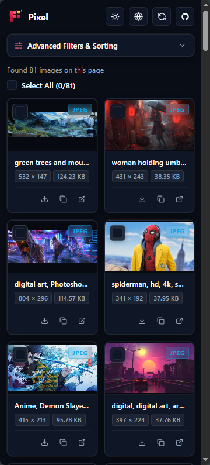
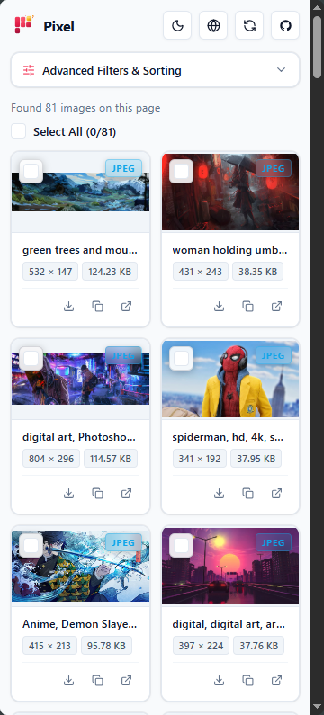

#  Pixel — Chrome Extension

<p align="center">
  <em>A high-performance Chrome Side Panel extension for extracting, inspecting, converting, and batch exporting images from any webpage.</em>
</p>

<p align="center">
  
  
  
  
  
  
  
</p>

<p align="center">
  <a href="https://github.com/ichshakib/pixel-image-extractor/releases/download/v1.0.2/pixel-image-extractor-chrome-extension-1.0.2.zip">
    
  </a>
  &nbsp;&nbsp;
  <a href="https://ichshakib.github.io/pixel-image-extractor/">
    
  </a>
</p>

---

## 📖 Overview

**Pixel — Image Extractor** is a modern Chrome extension built on **Manifest V3**. It embeds directly into Chrome's native Side Panel to provide a persistent, non-intrusive asset extraction and management workspace while you browse.

Pixel scans webpage DOM trees—including deeply nested **Shadow DOM** boundaries—to discover all images, SVGs, background assets, and lazy-loaded resources. It also adds a right-click **"Pixel — Save Image As"** context menu that converts and saves images directly into various raster, vector, or document formats without leaving the page.

---

## ✨ Key Features

### 🔍 Deep Asset Discovery & Extraction

- **Comprehensive Scanning:** Identifies images from `` elements, `<picture>` responsive sources, SVG `<image>` elements, and CSS inline `background-image: url(...)` styles.
- **Shadow DOM Traversal:** Iteratively traverses open Shadow Roots to extract encapsulated images within web components.
- **Lazy Load Recognition:** Automatically detects delayed and lazy-loaded images across common attributes (`data-src`, `data-lazy-src`, `data-original`, `data-srcset`, `data-url`, `data-image`).
- **URL Normalization & Deduplication:** Resolves relative URLs to absolute HTTP/HTTPS/data URLs and deduplicates identical image references.
- **Live Metadata Enrichment:** Performs concurrency-controlled asynchronous `HEAD` requests to detect actual file sizes and MIME types.

### 🎛️ Advanced Filtering & Sorting

- **Collapsible Filter Accordion:** Clean interface with active badge indicator and one-click reset.
- **Multi-Property Sorting:**
  - File Size
  - Pixel Width
  - Pixel Height
  - Total Dimensions (Width × Height)
  - MIME Type
- **Sort Direction:** Quick toggle between Ascending and Descending order.
- **Targeted Filters:** Filter images by detected resolution or MIME format (`PNG`, `JPEG`, `WEBP`, `GIF`, `SVG`, etc.).

### 📦 Batch Download & Export

- **Individual or Select All:** Select individual cards or use the master toggle to select all filtered images.
- **Bulk ZIP Packaging:** Uses [JSZip](https://stuk.github.io/jszip/) to bundle all selected images into a single `.zip` archive on the client side.
- **Metadata Export:** Export selected image metadata (URL, alt text, dimensions, file size, MIME type) as **CSV** or **JSON**.
- **Direct Card Actions:** Download single image, copy URL to clipboard, or open image in a new tab.

### 🖱️ Right-Click "Save Image As" Context Menu

Convert and save any image instantly from the context menu:

- **Save as PNG (.png)** — Lossless transparent export
- **Save as JPG (.jpg)** — Standard JPEG with white background fill for transparency
- **Save as WebP (.webp)** — High-efficiency modern web format
- **Save as JFIF (.jfif)** — JPEG File Interchange Format
- **Save as GIF (.gif)** — Preserves animations or generates 256-color palette GIFs via `omggif`
- **Save as PDF (.pdf)** — Pure client-side PDF 1.4 document embedding the image at native resolution
- **Save in Original Format** — Direct download without re-encoding
- **Copy Image Address** — Fast clipboard copy
- **Extract All Images on Page...** — Shortcut to open the Pixel Side Panel

### 🎨 Design & Accessibility

- **Dual Themes:** Full Light and Dark mode support with automatic system preference detection (`prefers-color-scheme`).
- **100% Pure CSS:** Zero heavy UI dependencies (no Tailwind, no shadcn/ui). Built with custom CSS custom properties and responsive grid styling.
- **Non-blocking Offscreen Work:** Conversions and packaging run via Service Workers and Offscreen Canvas, falling back smoothly to in-tab scripts for protected blob URLs.
- **100% Private & Local:** All processing occurs locally in the browser; no browsing data or images are ever transmitted to external servers.

---

## 📸 Extension Preview

|                                         🌙 Dark Mode                                         |                                         ☀️ Light Mode                                          |
| :------------------------------------------------------------------------------------------: | :--------------------------------------------------------------------------------------------: |
|  |  |

---

## 🏗️ Architecture & Project Structure

The extension follows the Chrome Extension Manifest V3 architecture with modular TypeScript components:

```
chrome-extension/
├── manifest.config.ts        # Dynamic Chrome Manifest V3 configuration
├── vite.config.ts            # Vite 8 + CRXJS + ZIP packaging configuration
├── package.json              # Extension metadata and dependencies
├── tsconfig.json             # TypeScript configuration
├── public/                   # Static assets & icons
│   ├── icons/                # Extension action icons (16, 32, 48, 128px)
│   ├── extension_demos/      # Demo screenshots (dark.png, light.png)
│   └── logo.svg              # Extension brand vector
└── src/
    ├── background/           # Background Service Worker
    │   ├── index.ts          # Extension lifecycle & side panel behavior setup
    │   ├── contextMenus.ts   # Context menu creation & click routing
    │   └── imageDownloader.ts# Image format conversion (OffscreenCanvas / PDF / GIF)
    ├── content/              # Content Scripts
    │   └── main.tsx          # DOM & Shadow DOM image scraping engine
    ├── sidepanel/            # Side Panel UI (React 19)
    │   ├── index.html        # Side panel HTML entry
    │   ├── main.tsx         # React root mounting
    │   ├── App.tsx           # Side panel layout & orchestration
    │   ├── index.css         # Complete vanilla CSS design system & tokens
    │   ├── types.ts          # Core data models and filter types
    │   ├── components/       # Side panel UI components
    │   │   ├── Header.tsx             # Brand header, theme toggle, refresh
    │   │   ├── FilterBar.tsx          # Accordion filters & sorting controls
    │   │   ├── FloatingActionBar.tsx  # Sticky batch actions (ZIP, CSV, JSON)
    │   │   ├── ImageGrid.tsx          # Responsive multi-column layout
    │   │   ├── ImageCard.tsx          # Individual image preview card & actions
    │   │   ├── EmptyState.tsx         # Empty state illustration & message
    │   │   ├── LoadingSkeleton.tsx    # Shimmer loading placeholders
    │   │   ├── ErrorBoundary.tsx      # Error fallback boundary
    │   │   └── Toaster.tsx            # Toast notification container
    │   ├── services/
    │   │   └── imageExtractor.ts      # Tab extraction & metadata fetching
    │   ├── store/
    │   │   ├── useImageStore.ts       # Zustand centralized state store
    │   │   └── imageFilters.ts        # Filtering and sorting computation
    │   └── utils/
    │       ├── export.ts              # Single download, CSV, JSON helpers
    │       └── toast.ts               # Custom toast notification utility
    └── utils/
        └── converters.ts     # Client-side PDF 1.4 & GIF palette quantizer
```

---

## 🚀 Getting Started

### Prerequisites

- [Node.js](https://nodejs.org/) (version 18.0.0 or higher recommended)
- [pnpm](https://pnpm.io/) or [npm](https://www.npmjs.com/)

### 1. Install Dependencies

Using `npm`:

```bash
npm install
```

Or using `pnpm`:

```bash
pnpm install
```

### 2. Development with Hot Module Replacement (HMR)

Start the Vite development server powered by `@crxjs/vite-plugin`:

```bash
npm run dev
```

1. Open Google Chrome and navigate to `chrome://extensions/`.
2. Enable **"Developer mode"** via the toggle switch in the top right corner.
3. Click **"Load unpacked"**.
4. Select the `dist/` directory inside `chrome-extension/`.
5. Open any webpage, click the **Extensions** puzzle icon, and click **Pixel — Image Extractor** to open the side panel.
6. Changes in your source code will automatically reload in the extension via HMR!

### 3. Production Build

To build the production-ready extension:

```bash
npm run build
```

This will:

1. Run TypeScript validation (`tsc -b`).
2. Generate the optimized bundle in the `dist/` folder.
3. Package a zipped extension archive into the `release/` directory (e.g. `release/pixel-image-extractor-chrome-extension-1.0.2.zip`) ready for distribution or the Chrome Web Store.

---

## 🔒 Permissions & Security

Pixel requests only the permissions necessary to deliver its core functionality:

| Permission     | Purpose                                                                                              |
| :------------- | :--------------------------------------------------------------------------------------------------- |
| `sidePanel`    | Displays the full extraction and management interface within Chrome's native Side Panel.             |
| `activeTab`    | Accesses the active tab's DOM only when explicitly invoked by the user.                              |
| `scripting`    | Executes the extraction engine and fallback canvas conversions within the active page.               |
| `contextMenus` | Registers the right-click "Pixel — Save Image As" options for web images.                            |
| `downloads`    | Saves extracted images, converted files, and bundled `.zip` archives to the user's downloads folder. |
| `<all_urls>`   | Enables image extraction and context menu actions across any web domain.                             |

> **Privacy Guarantee:** All extraction, analysis, conversion, and compression tasks occur locally inside your browser session. Pixel makes no external API calls and never collects or tracks browsing history.

---

## 🛠️ Tech Stack

- **Framework:** [React 19](https://react.dev/)
- **Language:** [TypeScript 5.9](https://www.typescriptlang.org/)
- **Bundler & Tooling:** [Vite 8](https://vitejs.dev/) + [@crxjs/vite-plugin](https://crxjs.dev/vite-plugin)
- **State Management:** [Zustand 5](https://github.com/pmndrs/zustand)
- **Archive Generation:** [JSZip](https://stuk.github.io/jszip/)
- **GIF Encoding:** [omggif](https://github.com/deanm/omggif) with custom Euclidean distance color quantization
- **PDF Generation:** Custom client-side PDF 1.4 DCTDecode stream builder
- **Icons:** [lucide-react](https://lucide.dev/)
- **Styles:** Pure Vanilla CSS (custom properties, glassmorphism, responsive grid)

---

## 📄 License

This project is licensed under the [MIT License](LICENSE).
